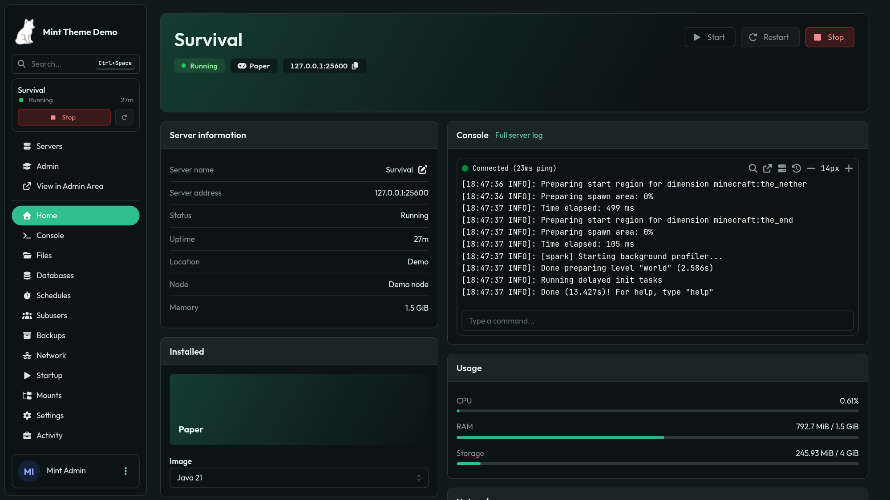
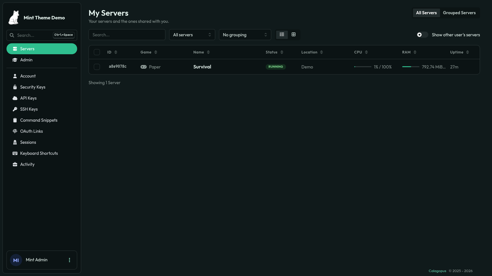
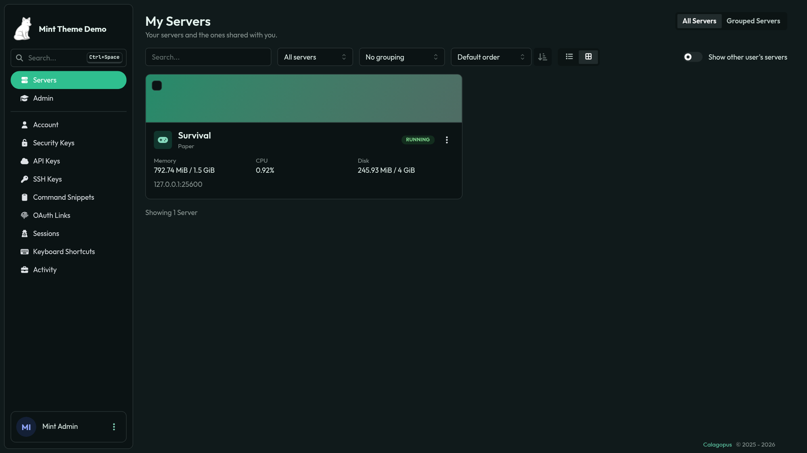
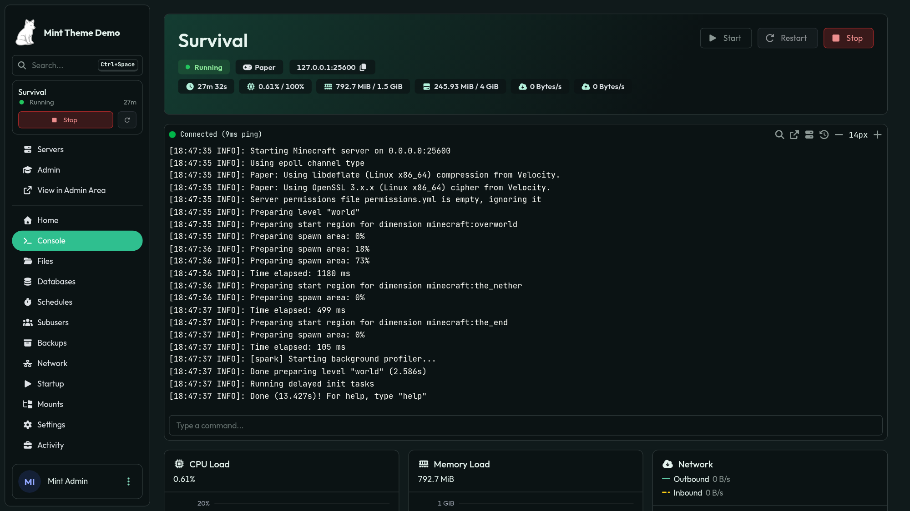
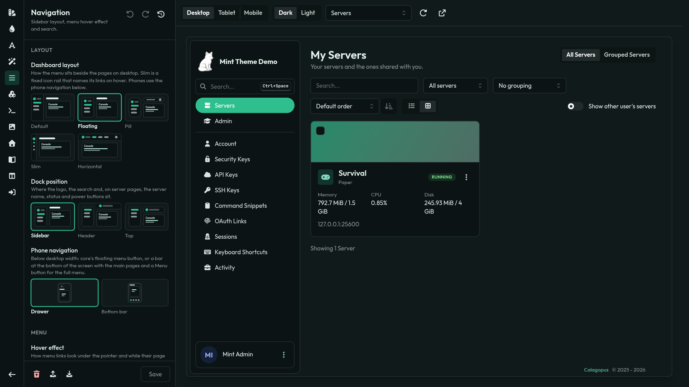

# Mint Theme for Calagopus

A dark theme for [Calagopus Panel](https://calagopus.com) with a live, built-in theme editor.

## Features

- **Server list**: a table with game, status, location, CPU, RAM and uptime, or a grid of cards with
  each game's banner and icon. Search and a status filter included. Sort by any column (click a table
  header, or pick it in the grid) and group by location, game or status. Tick servers (or select all in the
  table header) in either view to start, restart or stop them together from the bulk action bar. On
  phones the table keeps the name and status, and the columns come back as the screen widens. The grid's
  cards come as the default art header, a banner strip, flat, linear rows, minimal or compact tiles, and
  a table style turns every row of the panel's tables (files, backups, databases, admin lists, this list)
  into a card of its own.
- **Server home**: a new landing page with a banner header, power controls, server info, image switcher,
  console preview, usage and network. Admins choose which cards show and in what order.
- **Console**: by default the banner with live stats on top, a full width terminal, then the charts. Admins
  arrange the banner, stat tiles, server info, each chart and other extensions' cards above, beside or below
  the terminal; a chart moved elsewhere keeps the history it already drew.
- **Account page**: a profile header with a banner each user uploads themselves. Click the avatar to
  change it.
- **Sidebar**: optional collapsible sections, named from each egg's own menu dividers. On desktop the menu
  sits flush, floats as a card or a rounded pill with a slim top bar, shrinks to an icon rail with
  tooltips, or turns into a top bar with the sections as dropdowns. The logo, search and server block
  (name, status, power buttons) can move out of it into a header or a floating bar above the pages.
- **Phone navigation**: phones keep core's slide out menu or get a bottom bar with the main pages (Home,
  Console, Files and more on a server; Servers, Account, Admin on the dashboard) and a Menu button for the rest.
- **Phone file editor**: on phones the file editor (Monaco) wraps lines, drops the minimap and popups, uses a
  16px font and gets a row of keys above the keyboard: undo, redo, indent, find, the symbols phone keyboards
  hide and arrows. On by default; desktops are unchanged.
- **Menu links and search**: menu links can highlight filled, as a pill, or with just the icon in a tile, and
  the top of the menu can hold Quick actions, a server selector or a search bar for servers (and users, for
  admins).
- **Announcement buttons**: give any panel announcement a call to action button with its own text and
  link, shown under the announcement on the dashboard and server pages.
- **Login pages**: login, registration and password pages in core's card, flat, beside a full height or
  floating image banner, or in one panel with the banner, with the logo in a top bar or above the form and
  up to four support links (Discord, GitHub, docs, status and more).
- **Light mode**: a light palette of its own that reaches the console, the panel's grey hint texts and the
  chart labels too. The text on accent colour applies to solid buttons, badges and the current menu link in
  both modes. A first visit waits for the theme (1.5s at most) instead of flashing the default look.
- **Theme editor**: a full screen editor with a live preview of the real panel, in dark or light mode.
  Presets, the full colour palette with its own light mode colours, fonts (plus a monospace font for
  code and the console), corner radius, button styles, block transparency with an optional glass blur,
  block and input borders, a click effect, a glassy toast style, page transitions, optional server page
  titles, card title styles (line, fill, pill, also on the admin Settings section headings), stat card styles,
  server card and table styles, background
  image, a browser tab icon, a login page background
  and logo, per game artwork, getting started links and
  the home layout. Undo, redo, import and export. Colour pairs that are hard to read get a contrast warning
  with their ratio.
- **Presets, user themes and history**: save the editor's look as a preset of your own (up to 20, rename or
  delete them any time), let users pick any built-in or saved preset as their own theme on the account page
  (colours and style only; content and the login pages stay yours), and bring back any of the last 10 saved
  themes from the editor's history.
- **Languages**: every string comes in all the panel's languages: English, Arabic, Chinese, Danish, French,
  German, Italian, Japanese, Latvian, Polish, Portuguese, Romanian, Russian, Slovak, Spanish, Swedish,
  Turkish and Vietnamese.

## Screenshots

| Server list | Grid view |
| --- | --- |
|  |  |

| Console | Theme editor |
| --- | --- |
|  |  |

## Demo

A demo is available here: https://mintdemo.caloptreyx.com.
This demo resets at every hour, and saving is turned off there.

## Installation

> [!NOTE]
> Requires Calagopus Panel **1.2.0** or newer.

1. Download `dev_caloptreyx_mint.c7s.zip` from the [latest release](https://github.com/Caloptreyx/Mint-Theme/releases/latest).
2. In the panel, open **Admin → Extensions** and install the file.
3. Restart the panel.

The extension is listed as **Mint Theme** (`dev.caloptreyx.mint`). New releases show up under
**Admin → Updates** with their changelog.

> [!IMPORTANT]
> **Upgrading from 1.2.1 or older?** Those versions used the ID `dev.s4way.nebula`, so the panel sees 2.0
> as a different extension. Under **Admin → Extensions**, remove the old Mint Theme and install the new zip,
> then rebuild once. Your saved theme and announcement buttons carry over.

## Usage

Open **Admin → Theme Editor**. Every change previews live, and **Save** applies it for all users,
including on the login page.

To add a button to an announcement, open **Admin → Announcements**, pick one and switch to its
**Call to Action** tab.

The theme changes the panel at runtime and never overrides core files, so disabling the extension
brings back the stock panel.

## Contributing

[AGENTS.md](AGENTS.md) explains how the theme is built, how it hooks into the panel and how to test a
change. It is written for people and AI assistants alike.

## Notes

Built with Claude Code. Provided as is, with no promise of updates.

## License

Code is [MIT](LICENSE). The bundled fonts (Exo 2, Montserrat, Outfit, Plus Jakarta Sans, Space Grotesk,
JetBrains Mono, Fira Code) are under the SIL Open Font License 1.1;
their licence texts are in [`frontend/src/fonts`](frontend/src/fonts).
